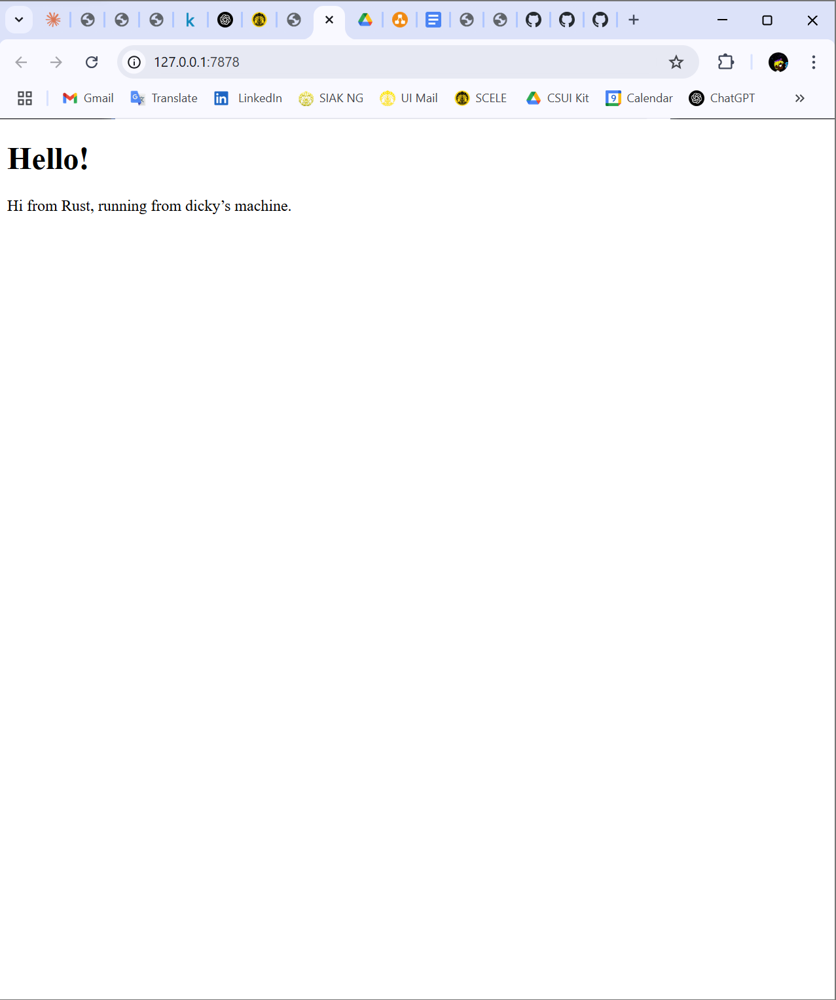
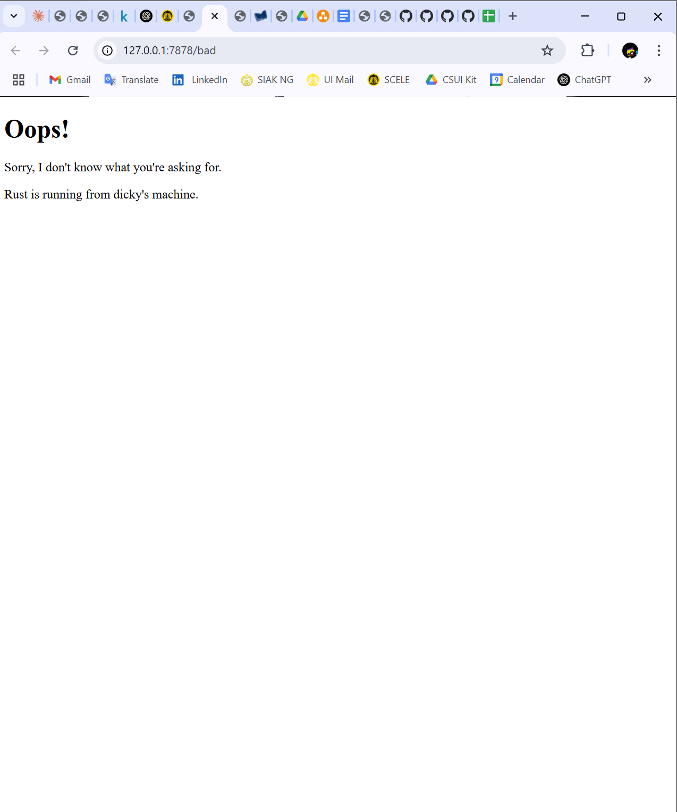

## Commit 1 Reflection Notes
### Handle Connection and Response

In this milestone 1, I implemented the handle_connection function to process incoming TCP streams. This method reads HTTP requests from clients using a buffered reader, collects the request lines, and prints them to the console. By handling connections in a structured manner, the server can properly interpret incoming requests and prepare responses.

Throughout this process, I gained a deeper understanding of Rust's standard library, particularly its BufReader and iterator methods. Implementing the request-handling logic helped me reinforce my knowledge of error handling, method chaining, and functional programming concepts in Rust.

## Commit 2 Reflection Notes

In this milestone, I updated the `handle_connection` function to properly handle HTTP responses by serving an HTML file. The function reads the incoming request using a buffered reader, processes the lines until it encounters an empty line, and then constructs a valid HTTP response. This response includes a status line, content length, and the contents of the `hello.html` file.

By implementing this, I learned more about how Rust handles file I/O operations and how to properly format an HTTP response. Understanding the `BufReader` and how to map and filter lines helped me process the request efficiently. Additionally, formatting the response correctly is crucial to ensure compatibility with web browsers.

## Commit 3 Reflection Notes

In this milestone, I implemented request validation to ensure that the server responds appropriately based on the requested URL. Previously, the server returned the same `hello.html` file regardless of the request. Now, it distinguishes between valid and invalid requests. If the request is for `/`, the server serves `hello.html`. Otherwise, it responds with a `404 Not Found` status and serves the `404.html` file.

This implementation required modifying the `handle_connection` function to check the request path and return the appropriate response. I used Rust's file-handling capabilities to read and serve the correct HTML file, ensuring that the server correctly formats HTTP responses. Through this process, I learned more about HTTP response structures, Rust’s file I/O operations, and how to efficiently handle different request paths. Understanding how to parse HTTP requests and properly construct responses was crucial in making the server more dynamic and functional.

